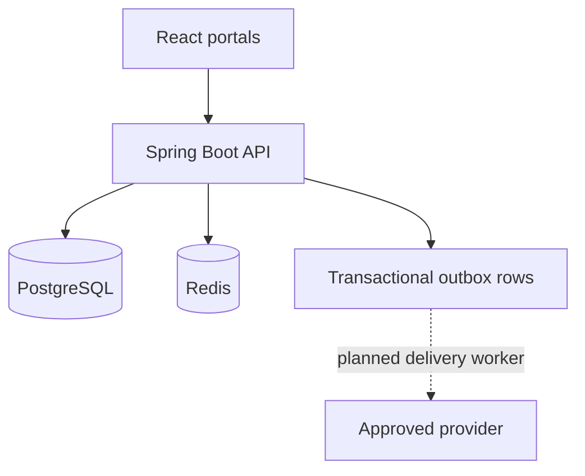
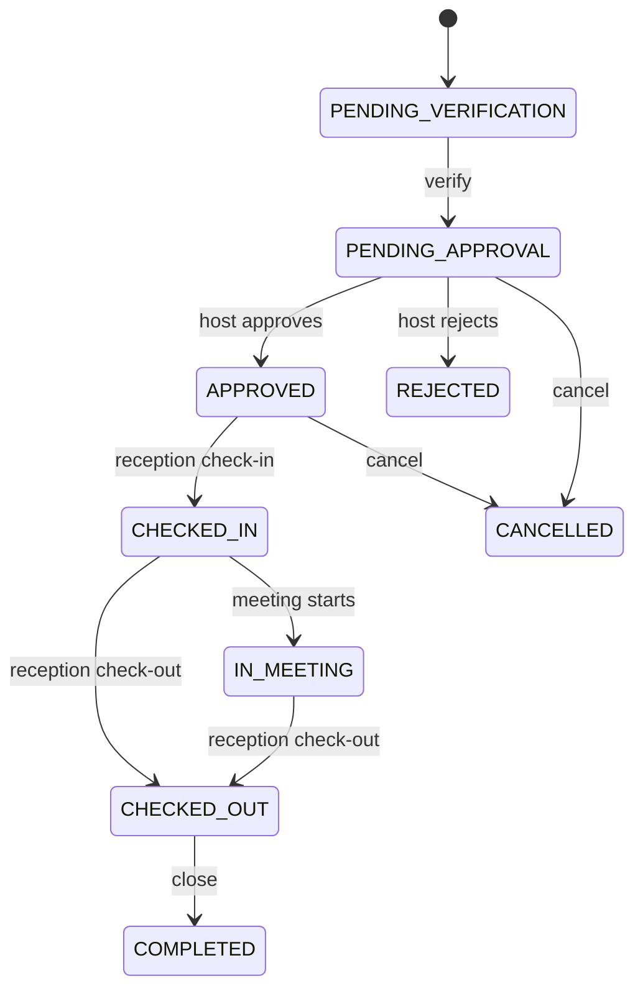
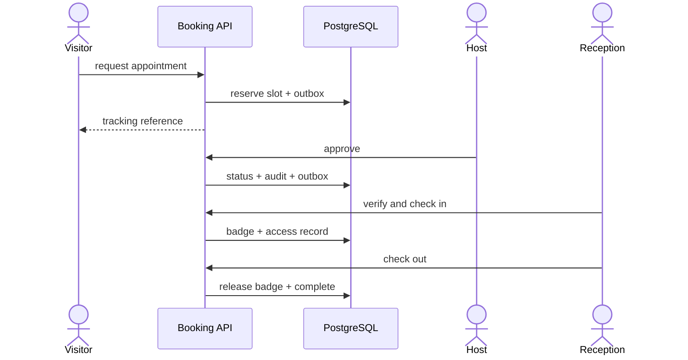

# Architecture

## Component view

The backend is one deployable modular monolith. Domain packages own their tables and expose
application services or events; controllers never return JPA entities.

## Domain ownership

| Module | Owns | Public boundary |
| --- | --- | --- |
| IAM | accounts, roles, permissions, refresh sessions | authenticated principal and grants |
| Organization | branches, departments, designations | active organization references |
| Employee | profile, employment status, manager relationship | safe directory/profile DTOs |
| Compensation | packages and approval workflow | salary-specific DTOs only |
| Availability | rules and overrides | bookable UTC slots |
| Appointment | request, approval, status history | booking and host decision use cases |
| Visitor | profile, consent, restrictions | verification result |
| Reception | arrival, badge, access record | current-inside/emergency projections |
| Notification | transactional outbox rows | event persistence |
| Audit | append-only privileged activity | secured audit query |
| Reporting | read projections | role-specific dashboards |
| Configuration | safe public and privileged settings | typed configuration |

## Appointment lifecycle

Every transition is explicitly validated. Audit and outbox rows are inserted in the same database
transaction as the aggregate change.

## Visitor request sequence

## Data and transaction rules

- UUIDs are internal identifiers; employee and appointment references are separate business IDs.
- UTC `timestamptz` is used for instants.
- money is `numeric(19,2)` and mapped to `BigDecimal`.
- optimistic `version` columns protect updates.
- important records are deactivated or transitioned, never casually deleted.
- Flyway is the schema authority; Hibernate uses `ddl-auto=validate`.
- a partial unique index prevents concurrent active bookings for the same host/start.
- compensation is absent from employee tables and DTOs.

## Extension roadmap

The current release deliberately stops at transactional outbox persistence. Provider dispatch,
document storage, and malware scanning should be added as application ports with managed adapters;
they are not represented as completed interfaces in this source. Redis backs rate limits, while OTP
hashes remain in PostgreSQL with a ten-minute validity window. Kafka is intentionally absent until
throughput or external integration makes it necessary.
